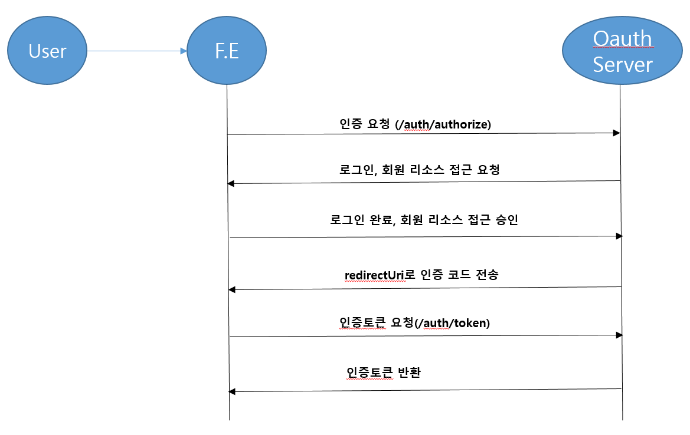

# OAuth2 Introduction
##  기본적인 용어와 역할 
- 리로스 소유자(Resource owner) : 이 역할은 리소스에 대한 접근을 통제. 이 접근은 허가된 권한 부여의 범위에 자한을 받는다.
- 권한 부여(Authorization grant) : 접근을 위한 권한 부여. 접근 제어를 위한 다양한 옵션이 제공된다. (권한 부여 코드, 암묵적, 자원 소유자 비밀번호 자격증명, 클라이언트 자격 증명)
- 리소스 서버(Resource Server) : 특별한 토큰을 사용해서 공유할 수 있는 소유자의 자원을 저장하는 서버
- 권한 부여 서버(Authorization Server): 자원에 접근하기 위한 키의 할당, 토큰, 그리고 다른 임시 자원 접근 코드를 관리. 관련된 사용자에게 접근이 허락되도록 보장.
- 액세스 토큰(Access Token): 자원에 대한 접근을 허용하는 키   



## 권한 부여 서버 구축
스프링 부트와 스프링 시큐리티를 사용하면 권한 부여 서버의 생성, Configuration, 실행을 쉽게 할 수 있다.   
```groovy
plugins {
    id 'org.springframework.boot' version '2.4.3'
    id 'io.spring.dependency-management' version '1.0.11.RELEASE'
    id 'java'
    id 'war'
}
group 'com.bithumbsystems'
version '1.0-SNAPSHOT'
targetCompatibility = "13"

repositories {
    mavenCentral()
}

configurations {
    compileOnly {
        extendsFrom annotationProcessor
    }
}

apply plugin: 'io.spring.dependency-management'
dependencyManagement {
    imports {
        mavenBom 'org.springframework.cloud:spring-cloud-dependencies:2020.0.0'
    }
}

dependencies {
    implementation("org.springframework.cloud:spring-cloud-starter-oauth2:2.2.5.RELEASE")
    implementation("org.springframework.cloud:spring-cloud-starter-security:2.2.5.RELEASE")

    annotationProcessor("org.springframework.boot:spring-boot-configuration-processor")
    developmentOnly("org.springframework.boot:spring-boot-devtools")
    implementation("org.springframework.boot:spring-boot-starter-actuator")
    annotationProcessor("org.projectlombok:lombok")
    compileOnly("org.projectlombok:lombok")

    testImplementation("org.springframework.boot:spring-boot-starter-test") {
        exclude group: ("org.junit.vintage"), module: ("junit-vintage-engine")
    }
}

test {
    useJUnitPlatform()
}
```
oauth2와 security를 추가해야 한다.   Spring Cloud Version과 달라서 가져와 사용할 버전을 명시해야 한다.   

스프링 부트를 사용해 권한 부여 서버 패턴을 구현하려면 메인 클래스에 어노테이션을 사용하거나 Configuration 클래스에 @EnableAuthorizationServer를 적용하고 application.yml 파일에 security.oauth2.client.client-id와 security.oauth2.client.client-secret 속성을 제공하면 된다.   
변경 또한 매우 간단한데, 클라이언트의 자세한 서비스를 메모리로 구현하기 때문이다. 

### Authorization Server Config 생성 
application.yml을 사용하지 않고 클래스를 정의하여 설정할 수 있다.  Oauth2AuthorizationConfig를 생성하고 어노테이션을 붙여서 인증 서버를 활성화 한다.   
- @Configuration
- @EnableAuthorizationServer
- redirectUri
인증 완료 후 이동할 클라이언트 웹 페이지 주소로 code 값을 실어서 보낸준다.
- authorizedGrantTypes
인증 방식에는 총 4가지가 있다. 그 중 authorization_code 방식이 주로 사용됨.   
   - Authorization Code
     가장 대중적인 방식으로 Service Provider가 제공하는 인증 화면에 로그인하고 클라이언트 앱이 요청하는 리소스 접근 요청을 승인하면,   
     지정한 redirect_uri로 code를 넘겨주는데. 해당 code로 access_token을 얻는다.   
   - Implicit
     Authorization Code와 flow가 비슷하다. 인증 후 redirect_uri로 직접 access_token을 전달 받으므로, 전체 프로세스는 좀 더 간단해지지만 Authorization Code 방식에 비해 보안성은 떨어진다.   
   - password credential
     Resource Owner가 직접 Client에 아이디와 패스워드를 입력하고 Authorization 서버에 해당 정보로 인증받아 access_token을 직접 얻어오는 방식. access_token을 얻어올 때 Client에 아이디 패스워드가 노출되어 보안이 떨어지므로 일반적으로 공식 어플리케이션에서만 사용한다.   
   - client credential
     access_token을 얻는데 정해진 인증 key(secret)로 요청하며, 일반적인 사용보다는 server간 통신을 할 때 사용한다.   
- scopes   
  인증 후 얻은 accessToken으로 접근할 수 있는 리소스의 범위이다. 테스트로 read, write scope로 세팅한다. resouece서버(api서버) 에서는 해당 scope 정보로 클라이언트에게 제공할 리소스를 제한하거나 노출시킨다.
- accessTokenValiditySeconds
  발급된 accessToken의 유효시간(초) 이다. 

```java
package com.bithumbsystems.config;

import org.springframework.context.annotation.Configuration;
import org.springframework.security.oauth2.config.annotation.configurers.ClientDetailsServiceConfigurer;
import org.springframework.security.oauth2.config.annotation.web.configuration.AuthorizationServerConfigurerAdapter;
import org.springframework.security.oauth2.config.annotation.web.configuration.EnableAuthorizationServer;

@Configuration
@EnableAuthorizationServer
public class Oauth2AuthorizationConfig extends AuthorizationServerConfigurerAdapter {

    public void configure(ClientDetailsServiceConfigurer clients) throws Exception {

        clients.inMemory()
                .withClient("auth-security-id")
                .secret("authSecret")
                .redirectUris("http://localhost:9001/auth/callback")
                .authorizedGrantTypes("authorization_code")
                .scopes("read", "write")
                .accessTokenValiditySeconds(30000);   // 30s
    }
}
```
## SpringSecurity Config 생성
패스워드를 암호화를 위해서 PasswordEncoder를 구현해야 한다. 암호화 하지만 않으면 NoOpPasswordEncode를 사용한다.   
.headers().frameOptions().disable()은 security 적용 시 h2 console 사용이 막힌다. oauth로 시작하는 리소스는 authorization 서버 세팅시 자동으로 생성되는 주소를 누구나 접근할 수 있게 하기 위한 세팅이다.    
callback 테스트를 위한 uri와 h2 console용 주소도 모두 접근 가능하도록 설정한다.    
security 로그인 화면은 일단 기본 폼을 사용하도록 세팅한다.   
```java
package com.bithumbsystems.config;

import io.netty.util.internal.NoOpTypeParameterMatcher;
import org.springframework.context.annotation.Bean;
import org.springframework.context.annotation.Configuration;
import org.springframework.security.config.annotation.authentication.builders.AuthenticationManagerBuilder;
import org.springframework.security.config.annotation.web.builders.HttpSecurity;
import org.springframework.security.config.annotation.web.configuration.EnableWebSecurity;
import org.springframework.security.config.annotation.web.configuration.WebSecurityConfigurerAdapter;
import org.springframework.security.crypto.password.NoOpPasswordEncoder;
import org.springframework.security.crypto.password.PasswordEncoder;

@Configuration
@EnableWebSecurity
public class SecurityConfig extends WebSecurityConfigurerAdapter {
    @Bean
    public PasswordEncoder noOpPasswordEncoder() {
        return NoOpPasswordEncoder.getInstance();
    }

    @Override
    protected void configure(AuthenticationManagerBuilder auth) throws Exception {
        auth.inMemoryAuthentication()
                .withUser("user")
                .password("pass")
                .roles("USER");
    }

    @Override
    protected void configure(HttpSecurity security) throws Exception {
        security
                .csrf().disable()
                .headers().frameOptions().disable()
                .and()
                .authorizeRequests().antMatchers("/oauth/**", "/auth/callback", "/h2-console/*").permitAll()
                .and()
                .formLogin().and()
                .httpBasic();
    }
}
```

## 공통 환경을 세팅을 위한 WebMvcConfig 생성 
```java
package com.bithumbsystems.config;

import org.springframework.context.annotation.Bean;
import org.springframework.context.annotation.Configuration;
import org.springframework.security.crypto.factory.PasswordEncoderFactories;
import org.springframework.security.crypto.password.PasswordEncoder;
import org.springframework.web.client.RestTemplate;
import org.springframework.web.servlet.config.annotation.CorsRegistry;
import org.springframework.web.servlet.config.annotation.WebMvcConfigurer;

@Configuration
public class WebMvcConfig implements WebMvcConfigurer {

    private static final long MAX_AGE_SECONDS = 3600;

    @Override
    public void addCorsMappings(CorsRegistry registry) {
        registry.addMapping("/**")
                .allowedOriginPatterns("*")
                .allowedMethods("GET", "POST", "PUT", "DELETE")
                .allowedHeaders("*")
                .allowCredentials(true)
                .maxAge(MAX_AGE_SECONDS);
    }

    @Bean
    public RestTemplate getRestTemplate() {
        return new RestTemplate();
    }

    @Bean
    public PasswordEncoder passwordEncoder() {
        return PasswordEncoderFactories.createDelegatingPasswordEncoder();
    }
}
```
Reference URL : https://daddyprogrammer.org/post/1239/spring-oauth-authorizationserver/

## application.yml
```yaml
server:
  port: 9001
spring:
  h2:
    console:
      enabled: true
      settings:
        web-allow-others: true
  datasource:
    url: jdbc:h2:mem:testdb
    dirver-class-name: org.h2.Driver
    username: sa
    password: password
  jpa:
    database-platform: org.hibernate.dialect.H2Dialect
    properties.hibernate.hbm2ddl.auto: update
    showSql: true
```
테스트 URL    
http://localhost:9001/oauth/authorize?client_id=auth-security-id&redirect_uri=http://localhost:9001/auth/callback&response_type=code&scope=read